#Exploration Activity 1

##Library
I utilised the image library in Racket

##What is the image library in Racket
The image library provides a number of basic image construction functions, along with combinators for building more complex images out of existing images. 
Basic images include various typical shapes, lines and text, as well as bitmaps. 
It also defines positioning functions such as rotate, scale, flip, and overlay/underlay etc.

###How do you use it
####Basic shape and line functions
As stated early it can create basic images of typical shapes such as circle, square etc.. and lines
In most shape defintion it will have have functions defined in this manner

`(circle size mode color)`

where size could be two or more parameters depending on the shape. For example

`(ellipse width height mode color)`

mode: This determines if the shape is filled or not, it could either be "outline" , "solid" or numbers ranging from 0-255 which deals with the transparency
color: this determins the color of the shape. Strings, symbols, and color structs are allowed as colors. 

For line defintion it will have have functions defined in this manner 

`(line x1 y1 pen-or-color)` 

This constructs an image representing a line segment that connects the points (0,0) to (x1,y1).
The use of the x and y axis are key when it comes to working with line functions. 
Lines can take in a color or a pen struct. The pen struct specifies how the drawing library draws lines more elaborately

####Positioning and editing images
This libray deals with edit and positioning of these images.
There are numerous functions definition that can be applied on an image and varied parameters required dependinf on function.
I will cover a few that I used in my sample code.

  1. `(overlay i1 i2 is ...)` - this takes in numerous images and places them on each other
  2. `(underlay i1 i2 is ...)` - this takes in numerous images and places them under each other
  3. `(beside i1 i2 is ...)` - this places numerous images in a horizontal row
  4. `(above i1 i2 is ...)` - this places numerous images in a vertical row

For all these positioning functions, there are various alignments that can be specified such as right, left, middle, top bottom
This could utilize the x and y axis.

There are also functions that can affect already existing images such as 
  
  1. `(rotate angle image)` - this uses a specified angle to rotate an image
  2. `(scale factor image)` - this uses a factor to change size of shape
  3. `(flip-horizontal image)` - this flips an image left to right
  4. `(flip-vertical image)` - this flips an image top to bottom
  5. `(crop x y width height image)` - this crops image to the rectangle with the upper left at the point (x,y) and with width and height.

####Bitmaps
DrRacket’s Insert Image ... menu item allows you to insert images into your program text, and those images are treated as images for this library.
These images re represented as bitmaps i.e., an array of colors
This means that scaling and rotating them loses fidelity in the image and is significantly more expensive than with the other shapes.
The bitmap function is defined this way

`(bitmap bitmap-spec)`

Loads the bitmap specified by bitmap-spec. If bitmap-spec is a string, it is treated as a relative path. 
If it is an identifier, it is treated like a require spec and used to refer to a file in a collection.
Bitmaps can take images from the web or a relative path.

####Image properties and predicates
This libray allows you to get the various specification of different images such as color, width, height etc..
To use these function just specify what you want and the image. For example:
`(image-height i)` 

####Text
This library also allows for the creation of detailed text. 
This basically means you can specify various parameters for your text such as the style, the size, underline etc..
A basic text function looks like this:
`(text/font string font-size color face family style weight underline?)`

##Functionalities of library
Here are some screenshots of code and the output

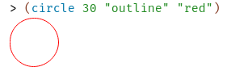

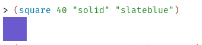

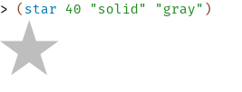

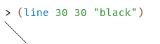

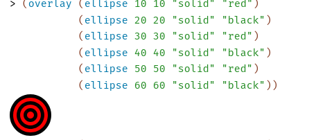

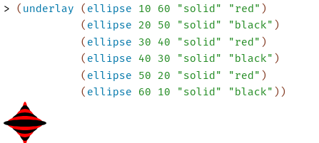

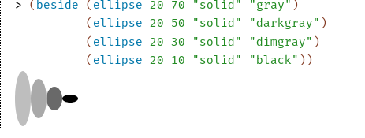

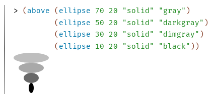

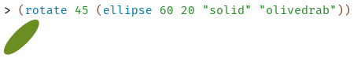

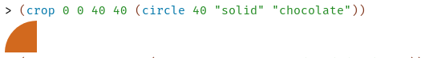

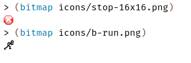

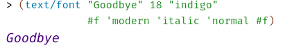

##When was it created
I could find any information on when or who created the library...

##Why did I select this library
One of the programming questions on racket required the use of images and although this image library was not used for the task, 
it was interesting to see how easily racket worked with images. I couldn't imagine doing the stuff I could do with images on racket on another language. 
That being said I do not know the scope of image manipulation on other languages but I just feel like it way easier with racket and very consise. 
So when deciding on a library I chose this image library to learn more about what racket could do with images.

##How did learning the library affect my learning of Racket
Well I can say I become more acclimtized to the Racket syntax and general procedures. 
I can also say that I understand more of the recursion that is easily used in Racket.
My knowledge of errors and debugging in Racket has also been imapcted.

##Overall experience 
I would definitely recommend this library to someone. Is is easy to learn and use and I'd say working with it is a fun experience
The one thing that I couldn't quite understand or figure out is using this library in a real world situation. 
It is fun to work with but where exactly would I need to work with this library.
This was my issue when writing a sample code, I couldn't really think of a program to maximize the image library functions.
However, there are many things that popped into my mind will working on this exploration actvity that I didn't have the time to delve into.
And problems I noticed that I haven't really worked out a solutuon for yet. 
Generally, I wouldn't mind working on this library more.

