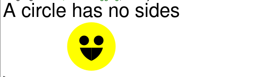

# Exploration Activity 1

## Library
I utilised the **image** library in Racket.     
This is how you implement the library  
**`(require 2htdp/image)`**

## Running the program
My program can be run from the DrRacket application. 

  1. Start the DrRacket application 
  2. Open the **.rkt** file 
  3. Click on the run button in the top right corner
  
  
## Purpose
My program recursively creates an underlay of polygons with a specificied size, mode and reducing n sides as specified by function call in rainbow colors.   
It also specially handles the case of n = 0, 1 and 2 as there a no polygons with that number of sides.   
n = 0 produces a smiley face (primarly a circle denoting the fact that a circle has no sides).   
n = 1 produces a vertical line.    
n = 2 produces a curved line.    

> ***Side note*** This code only runs for the range of n (0-8) due to specified color list.

## Sample input and output
input: **(rainbowShapes 50 8 "solid" )**   
output:    

input: **(rainbowShapes 50 6 "solid" )**  
output:   

input: **(rainbowShapes 50 0 "solid" )**   
output:     

input: **(rainbowShapes 50 1 "solid" )**   
output:    

input: **(rainbowShapes 50 2 "solid" )**  
output:    

